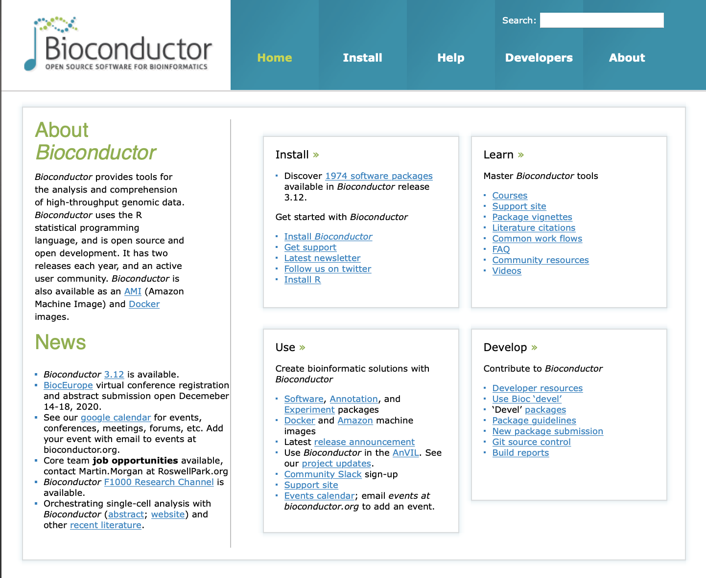
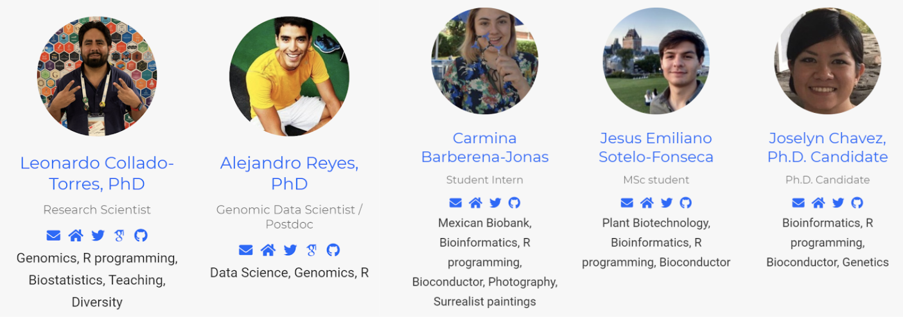
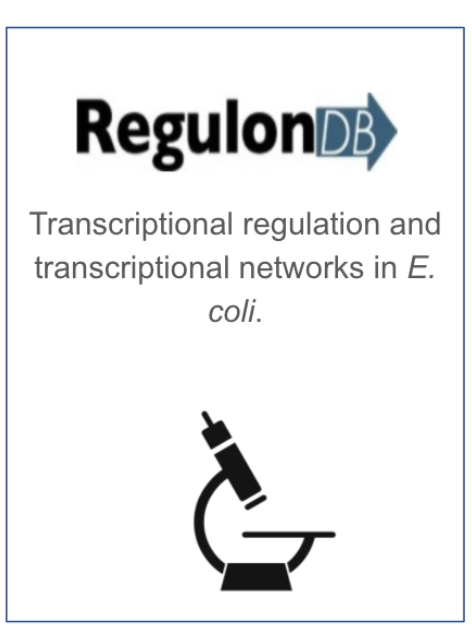
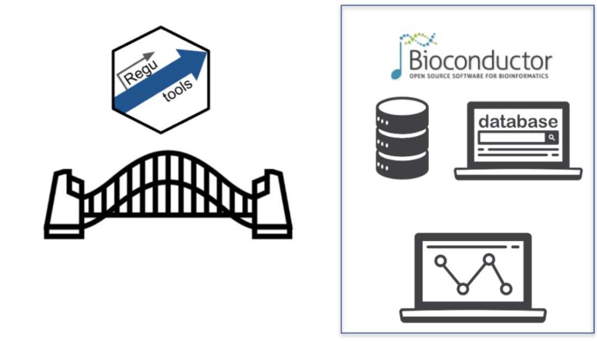
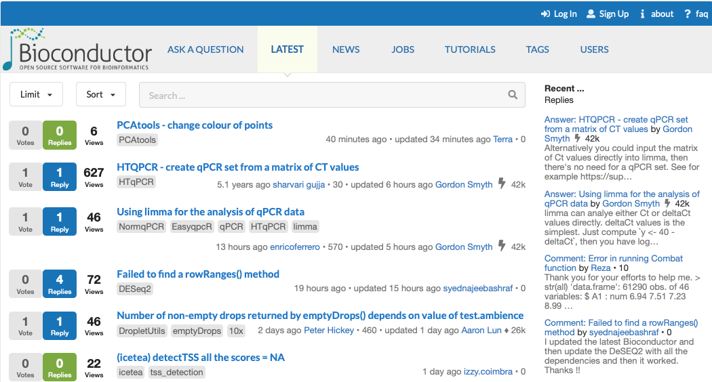
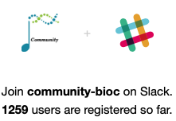
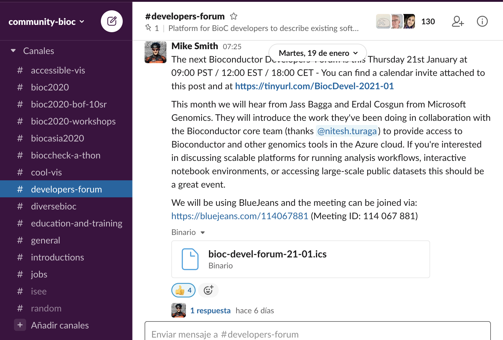
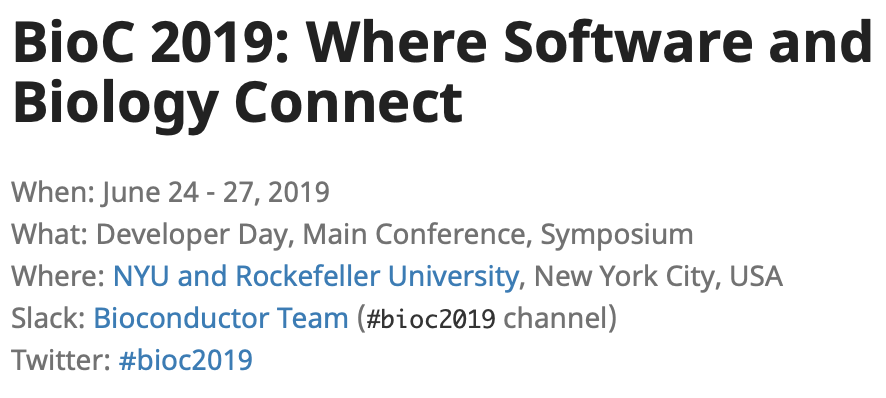
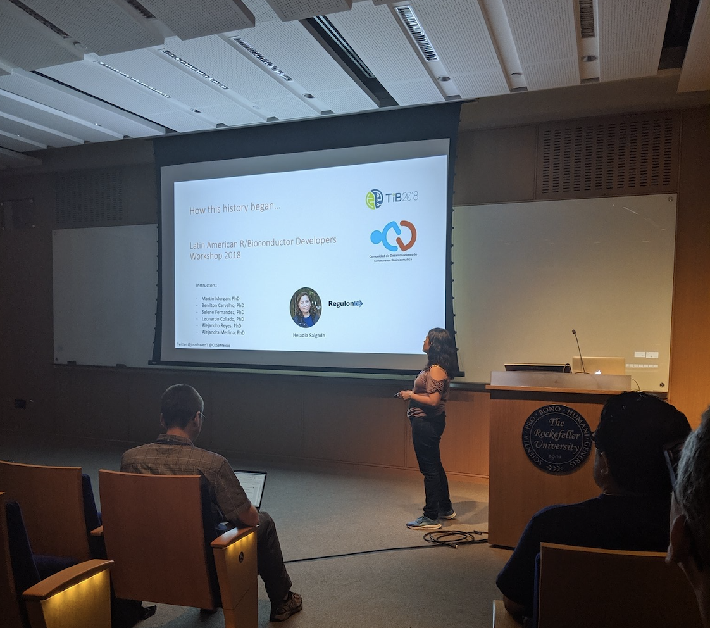
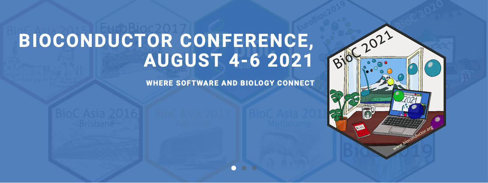

class: inverse center middle
background-image: url("images/joss.png"), url("images/rladies-bmore.png")
background-size: 140px, 140px
background-position: 90% 90%, 5% 5%


# `r rmarkdown::metadata$title`

## `r rmarkdown::metadata$author`

### `r rmarkdown::metadata$date`


```{r configuracion, include = FALSE}
xaringanExtra::use_clipboard()
```

---
.center[
# Materials are available at:

## http://github.com/josschavezf/intro_bioconductor

<br> 

# Or you can download them by running the following code in your R session: 
]

```{r, eval = FALSE}
if (!require("usethis")) {
    install.packages("usethis") }

usethis::use_course("josschavezf/intro_bioconductor")
```

---
# What is Bioconductor?

* A repository for the analysis of genomic data. 

* At date, contains 1974 software packages.

--
# Where is located? 

https://www.bioconductor.org



---
# What kind of packages can we find in Bioconductor?

In Bioconductor exist four types of packages:

* Software
* Annotation
* Experiment
* Workflow

---
# How do we access to Bioconductor?

We will use the package **BiocManager**  

Run the following code in your R session to install:

```{r, eval = FALSE}
if (!requireNamespace("BiocManager", quietly = TRUE))
    install.packages("BiocManager")
```

--

**BiocManager** help us to:

* Install any desire package from Bioconductor, for example the package **Biostrings**:

```{r, eval = FALSE}
BiocManager::install("Biostrings")
```

--

* Keep all your installed Bioconductor packages up to date. 

```{r, eval = FALSE}
BiocManager::install(version = "3.12")
```

<br>
Note: Bioconductor is updated twice a year, around April and October.

---
# The Bioconductor Environment

In Bioconductor, there are some kind of data, such as sequences and alignments that will be treated in a different way that we use to do with lists or data frames.

Let's see some packages that will help us to deal with genomics data.

* Biostrings
* GenomicRanges
* AnnotationHub
* Gviz
* SummarizedExperiment

---
# Manipulation of genomic sequences

The package **Biostrings** have functions to read, write and handling genomic sequences.

## Import data
```{r, eval=FALSE}
eco <- readDNAStringSet("../data/eco.fasta")
```

```{r, echo = FALSE, message=FALSE}
library(Biostrings)
eco <- readDNAStringSet("../data/eco.fasta")
eco
```

---
We can get some attributes of the data, as well as subset sequences of interest.


* Get the number of sequences
```{r}
length(eco)
```
--
* Get the number of characters on each sequence.
```{r}
nchar(eco)
```
--
* Get the frequency of specific characters 
```{r}
letterFrequency(eco, "GC")
```

---
* Subset sequences 
```{r}
eco[1:2]

subseq(eco,start = 1, end = 10)
```
--
* Translate sequences to amin acids
```{r}
translate(eco$`eco-b0001`)
```

---
# We can store more information from each sequence, such as genomic position and chromosome.

We need to use a **GRanges** object.


---
class: middle center

# Where can we find genomic data?

--

# AnnotationHub


---
# AnnotationHub

**AnnotationHub** connect with multiple genomic data providers and give us access to their data.

We use AnnotationHub() function to connect with the database. 

Now, we are ready to explore available data.

```{r, eval = FALSE}
ah = AnnotationHub()

ah$species
```

```{r, echo = FALSE}
library(AnnotationHub)
library(dplyr)
ah = AnnotationHub()
ah$species %>% 
  unique %>% 
  head(10)
```

At date, AnnotationHub contains data from 2643 species.

---
Once you find the desired data, you can download it to your session.

```{r, message = FALSE}
hg_genes <- ah[["AH5036"]]

head(hg_genes)
```

Note that the results is a GRanges object

---
# Annotation packages for specific organisms

```{r, eval = FALSE}
x <- org.Hs.eg.db
AnnotationDbi::select(x,
                      keys = "ATRX chromatin remodeler",
                      keytype = "GENENAME",
                      columns = c("ENTREZID", "ALIAS", "UNIPROT")
                      )

```

.center[
```{r, echo = FALSE, message=FALSE}
library(org.Hs.eg.db)
x <- org.Hs.eg.db
head(AnnotationDbi::select(x,
                      keys = "ATRX chromatin remodeler",
                      keytype = "GENENAME",
                      columns = c("ENTREZID", "ALIAS", "UNIPROT")
                      ),15 )
```
]


---
# You can submit your own packages!

.center[



]

--


--



.center[
<br><br><br><br><br><br><br><br><br><br>
http://www.bioconductor.org/packages/regutools 
]

---
# How regutools works?

First we need to connect with the database by creating a *regulondb* object:

```{r, echo=FALSE, message=FALSE}
library(regutools)
```

```{r, message=FALSE}
regulondb_conn <- connect_database()

e_coli_regulondb <-
    regulondb(
        database_conn = regulondb_conn,
        organism = "E.coli",
        database_version = "1",
        genome_version = "1"
    )
```

---
# Integration of regutools with the Bioconductor Ecosystem

The function **convert_to_granges()** converts a **regulondb_result** object into a **GRanges** object whenever possible to facilitate the integration with other Bioconductor workflows.

.pull-left[ 
```{r}
res <- get_dataset(
  regulondb = e_coli_regulondb,
  dataset = "GENE",
  attributes = c("posleft", "posright", "strand", "name"),
  filters = list("name" = c("araC","crp","lacI"))
)
```
]

.pull-right[
```{r}
convert_to_granges(res)
```
]

---
Integrating your package results with the Bioconductor Ecosystem facilitates
the use of other packages in downstream steps, for example for plotting.

```{r, eval = FALSE }
grange <- GenomicRanges::GRanges("chr",IRanges::IRanges(5000, 10000))

plot_dna_objects(
    regulondb = e_coli_regulondb,
    grange = grange,
    elements = c("gene", "promoter")
)
```

.center[
```{r,echo=FALSE, fig.height= 5}
e_coli_regulondb <-
    regulondb(
        database_conn = regulondb_conn,
        organism = "chr",
        database_version = "1",
        genome_version = "1"
    )

grange <- GenomicRanges::GRanges("chr",IRanges::IRanges(5000, 10000))

plot_dna_objects(
    regulondb = e_coli_regulondb,
    grange = grange,
    elements = c("gene", "promoter")
)
```
]

---
# The Bioconductor community is and infinite source of knowledge

.pull-left[
### Support page of Bioconductor
https://support.bioconductor.org


]

--

.pull-right[
### Slack channel


https://bioc-community.herokuapp.com 


]

---
# Share your contributions with the community!

.pull-left[



]

.pull-right[ 

]

--

.pull-right[   


<br><br><br><br><br><br><br><br><br><br><br>
https://bioc2021.bioconductor.org
]

---
class: inverse middle center

background-image: url("images/joss.png"), url("images/rladies-bmore.png")
background-size: 140px, 140px
background-position: 90% 90%, 5% 5%

# Thanks for your attention!

### Twitter: @josschavezf1

### josschavezf.netlify.app

---
class: inverse middle center

# These slides were made using the [xaringan](https://github.com/yihui/xaringan) package from Yihui Xie and the [rladies theme](https://alison.rbind.io/post/2017-12-18-r-ladies-presentation-ninja/) from Alison Hill.
